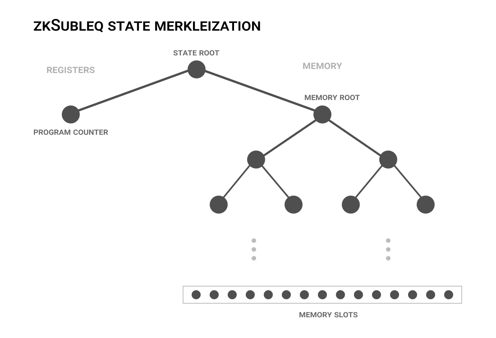

# zkSubleq

A VM based on the [Subleq one-instruction set computer](https://esolangs.org/wiki/Subleq) implemented in JS and circom.

**Subleq?**

Given three operands A, B, C
- _sub_: Set `Memory[B] -= Memory[A]`.
- _leq_: If the new value is less than or equal to 0, set `ProgramCounter = C`. Otherwise `ProgramCounter += 1`.

There is only one instruction, so no opcodes are needed. Other than the program counter (aka instruction pointer), there are no registers.

## How does it work?

To make zk-SNARKs practical, the state of the machine is Merkleized; only the memory slots involved in a given step are passed as input signals.



```circom
// Circuit for one VM step I/O

// **** INPUT ****
signal input pcIn; // Program counter value
signal input aAddr; // A operand (address)
signal input bAddr; // B operand (address)
signal input cIn; // C operand (instruction index)
signal input aIn; // Memory[A]
signal input bIn; // Memory[B]
signal input mRoot0; // Memory subtree root
signal input sRoot0; // State tree root
// Merkle proof elements (paths are derived in the circuit)
signal input aAddrPathElements[mLevels]; // aAddr -> mRoot
signal input bAddrPathElements[mLevels]; // bAddr -> mRoot
signal input cInPathElements[mLevels]; // cIn -> mRoot
signal input aInPathElements[mLevels]; // AIn -> mRoot
signal input bInPathElements[mLevels]; // bIn/bOut -> mRoot

// **** OUTPUT ****
// Values after step execution
signal output pcOut; // Program counter value
signal output mRoot1; // Memory subtree root
signal output sRoot1; // State tree root
```

```
MEMORY
+-----------+---+-------+-------+-----+---+-------+---+-------+---+
| Address:  | … |  I+0  |  I+1  | I+2 | … | aAddr | … | bAddr | … |
+-----------+---+-------+-------+-----+---+-------+---+-------+---+
| Value:    | … | aAddr | bAddr | cIn | … |  aIn  | … |  bIn  | … |
+-----------+---+-------+-------+-----+---+-------+---+-------+---+
                [_____________________]
                      instruction
(I=PC*3)
```

## Why does it suck?

**Instruction set too simple**

Turing-complete, yes. But using this for real-life programs would be super slow. Given that most of the constraints in the circuit come from validating Merkle proofs, a more sophisticated instruction set would not cost much and would speed things up a lot. It would be good to make it easily transpilable/compilable from a popular ISA/intermediate representation.

**One memory slot per signal**

Every leaf node in the state tree corresponds to a register or memory slot so values can go as high as circom integers (2^253+), as opposed to conventional computers limited to 8-bit memory slots. It would be better to pack multiple smaller registers/slots into a single value to make the state tree more shallow.

**Two many long Merkle proofs to validate**

The circuit validates 6 long Merkle proofs (memory slot -> memory root): aAddr, bAddr, cIn, aIn, bIn, bOut. A better machine would have a load-store architecture where most of the operations happen between registers (which would be in a much smaller subtree) and at most one memory slot is read from or written to every step (other than the instruction). This would lower the number of constraints _very_ significantly and would make the VM more compatible with existing RISC ISAs.

## Next steps

I'm making a VM implementing the improvements mentioned above based on a risc-v instruction set. I expect to be able to run transpiled real-world software for less than 75k constrains/step.
